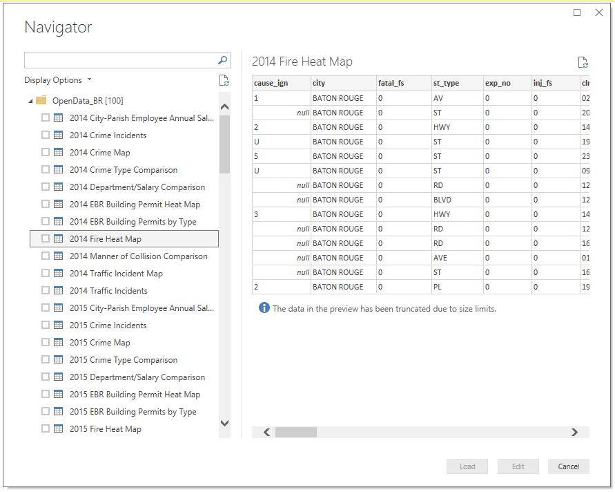

# OpenDataBR-PowerBiConnector
PowerBI Desktop Custom Connector for the OpenDataBR API

This connector will allow the user to connect with any of the Open Data BR endpoints. It gets the list of endpoints dynamically, and then builds the tables. Multiple    tables can be queried by Power BI with a single connection.
As this uses the [socrata Discovery API](https://socratadiscovery.docs.apiary.io), it should be able to query any of the open data sets using that model.

This connector was submitted as part of the Hackathon at the [2018 Activate Conference](http://www.activateconf.com).
