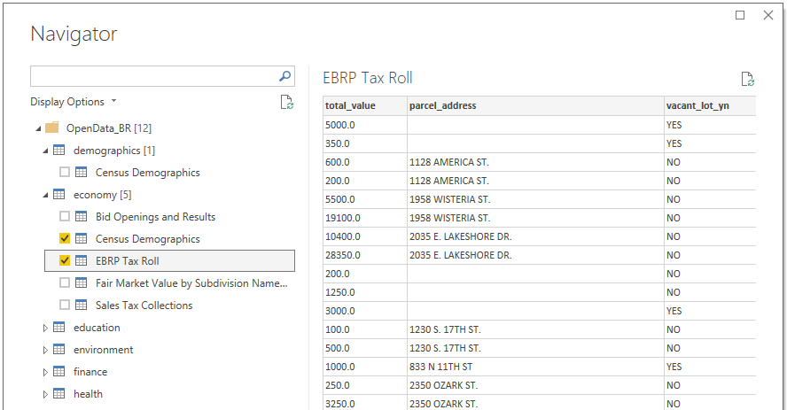
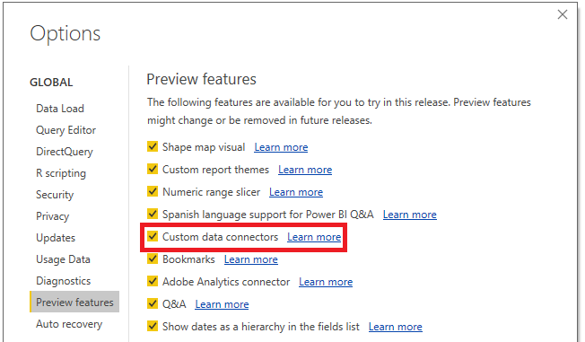
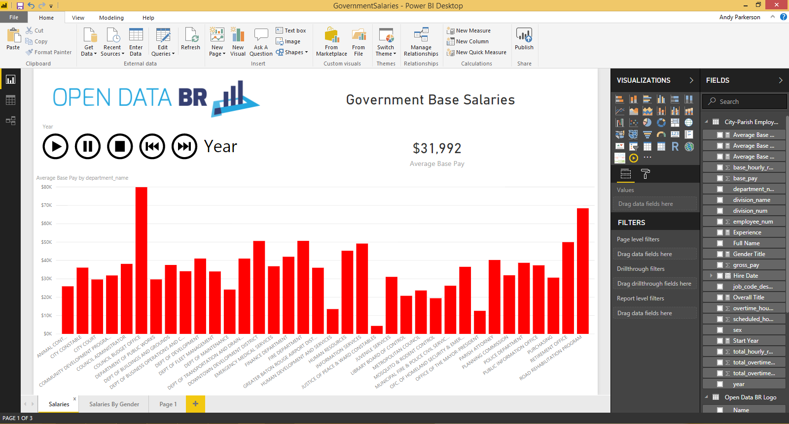

# OpenDataBR-PowerBiConnector
## PowerBI Desktop Custom Connector for the OpenDataBR API

This connector will allow the user to connect with any of the Open Data BR endpoints. It gets the list of endpoints dynamically, and then builds the tables. Multiple tables can be queried by Power BI with a single connection.

## Installation
To install, create a subdirectory in your documents folder named `"Microsoft Power BI Desktop\Custom Connectors\"`. Then copy `"/OpenData BR/bin/Debug/OpenData BR.mez"` to that folder.

Also, `Custom data connectors` must be selected under `Options > Preview features` settings in PowerBI Desktop. After this is selected, PowerBI Desktop must be restarted.

## Custom Data Connectors Information
More information about Power BI custom data connectors can be found at [Microsoft/DataConnectors](https://github.com/Microsoft/DataConnectors).

## PowerBI Report Examples
Several example reports will be found in the `examples` directory.

## Extensibility Notes
As this uses the [socrata Discovery API](https://socratadiscovery.docs.apiary.io), it should be able to query any of the open data sets using that model.

## Further Notes
This connector was submitted as part of the Hackathon at the [2018 Activate Conference](http://www.activateconf.com).
